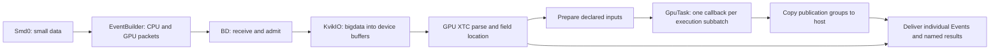

# Current GPU pipeline design

Reviewed against the implementation at `fa40ec52a` on 2026-09-29, with the
subsequent GPU default batch-size change to 20 included below. External
algorithms are unchanged since `6ba5fa586`. This is the implemented
experiment/run path for `RunSerial` and MPI `RunParallel`.

## Responsibilities and execution flow

A CPU BD process orchestrates each GPU. Smd0 reads small data; EventBuilder
aligns timestamps and constructs coherent CPU SMD and versioned `GPUBAT1`
descriptor packets. GPU kernels do not open files or drive MPI.



The direct parser-to-delivery path supplies input access when there is no task.
No automatic calibration, geometry algorithm or output D2H runs in that case.
User callbacks own science algorithms and their scratch/output allocations.
Psana owns scheduling, input preparation, dependency tracking and output delivery.

MPI uses the common transport:

```text
RunParallel.events -> _events_impl -> BigDataNode.start
  -> _batch_envelopes -> Events -> GpuEventManager.process_batch
  -> EventEnvelope -> RunParallel._materialize_event -> Event
```

`_batch_envelopes` posts a request for the next EB batch before yielding the
current one. `GpuEventManager` does not own MPI communication. It can issue one
GPU read ahead of CPU event materialization, waits for that read, then submits
the GPU execution. CPU and GPU event identity remains correlated by timestamp
and original batch event index. No separate GPU event loop is required in user
code. In serial mode `RunSerial` owns a `GpuEventManager` iterator fed by the
SMD reader/EventBuilder, and materializes the same public Event interface.

## Routing and setup

`DsParms.resolve_gpu_stream_ids()` routes whole streams. `gpu_det` gives selected
streams exclusive GPU ownership and requires each to contain only the selected
normal detector. `hybrid_det` keeps the same stream in both CPU and GPU packets;
it supports shared streams by reading their complete bigdata twice. A detector
cannot be selected in both modes, nor can exclusive/mirrored stream sets overlap.

MPI assigns devices before importing CuPy using `bd_rank - 1` within the EB
group and the configured GPU count. Automatic budgets count sharing BDs in that
same group. This is not node-wide coordination across EB groups; see
[limitations](limitations.md#multi-eb-device-accounting).

`GpuEventManager._setup_gpu_pipeline()` creates the shared device budget,
Configure tables, detector bindings, execution pool, parser and reader. It
resolves all configured event fields of selected detectors, excluding Configure
payload fields. Only task-declared dense inputs receive gather buffers; only
requested constants receive task device copies.

The current manager sets canonical segment IDs to the **sorted union of physical
segment IDs in Configure**. Dense rows follow that binding, not child-XTC byte
order. Always use `batch.segment_ids(detector)` to relate dense rows to physical
calibration-array indices. The parser independently resolves each physical field
through stream, NamesId and field identity.

GPU-exclusive detectors skip CPU-derived calibration/geometry preparation.
CPU/hybrid consumers retain their CPU setup. Late geometry variants missing from
node-shared startup caches compute locally instead of entering event-loop MPI
collectives. Requested task constants retain their original values; staging
never implicitly inverts gains or builds masks.

## Read grouping and execution batching

These sizes have different meanings:

| Control or object | Meaning |
| --- | --- |
| `batch_size` | Requested upstream event batching; defaults to 20 with GPU routing, 1000 for CPU-only runs |
| `GpuSubbatchView` | Complete-event slice admitted for one GPU execution |
| `gpu_bulk_target_bytes` | Small-input grouping target/classification, default 1 MiB |
| `InputWindow` | Lifetime owner of a read/parser allocation, possibly used by several executions |
| `n_gpu_streams` | Execution-slot depth, default 2 |
| Publication group | One contiguous output array with selected event-row mapping |

An explicit `batch_size` overrides the default. GPU routing means `gpu_det` or
`hybrid_det`, independently of whether a task is supplied. This is one setting
for the whole DataSource, including CPU detectors in mixed runs. The latest JF
staging and user-kernel scaling campaigns explicitly used 20. Good scaling
requires investigating batch size against the kernel work, scratch/output memory
and GPU/BD layout; other values still need workload-specific validation. The
default is not an automatic memory or performance optimum.

With bulk reads enabled (the default), `GpuFileEpochs` resolves chunk/file
identity from ordered transitions. `gpu_stream_read_plan` and
`gpu_group_schedule` separate small retained groups from execution-bounded
large groups. `InputGroupPool` owns their reader/parser storage and planned uses.
A small input can remain resident for several executions; an execution can use
multiple input windows. Read-group lifetime does not determine callback frequency.

`gpu_read_plan` coalesces adjacent ranges only within compatible stream/file
identity and the admitted window. Logical per-dgram descriptors still locate
individual payloads inside the allocation. Turning `gpu_bulk_read` off uses
per-dgram requests with execution-scoped input storage; it does not disable
batched user callbacks.

`KvikioGpuReader.wait_batch()` waits every submitted future, validates byte counts,
retains errors, and releases pending file references only after draining the
futures. The current source also synchronizes the CUDA null stream at execution
submission. Consequently the pipeline permits overlap but is not entirely
nonblocking on the host. KvikIO can use direct GDS or CPU fallback; availability
logging is not proof of direct I/O for every read. Accepted measurements use
explicit CPU fallback.

## Task submission and host delivery

`EventPool.submit()` waits on input-window readiness, constructs event views,
and selects rows with both GPU input and a matching CPU delivery envelope.
Requested dense inputs are aligned to exactly those rows; missing detector
segments are zero-filled with false presence. It calls `dispatch_task()` once
for a nonempty selected subbatch on the current producer stream. An empty
selection invokes no callback.

`BatchInputContext` uploads device identity/field metadata only if requested
during the callback. Dense-only callbacks incur no task-metadata upload. The
callback context expires on return. A producer completion event follows all
submitted work; context expiry does not mean the kernels have finished.

`batch.keepalive()` retains scratch; `batch.publish()` retains a device array and
maps its leading rows to selected event indices. The manager queues
`PublicationD2H` immediately after successful submission. Nonempty groups copy
once each on a copy stream that waits for producer completion. One terminal
copy-completion event covers that execution's payload copies. Multiple output
names or disjoint groups can require multiple copies.

Public `Event` delivery still occurs per event. `evt.gpu.get(name).on_cpu` waits
for its host token if needed and caches an independent NumPy row. It neither
invokes the callback nor starts the normal publication copy. Task outputs are
host-delivered; parsed input fields retain separate leased device access.

## Memory ownership and backpressure

The device ledger accounts for participating Configure, raw input, parser,
locator, dense-input, task-metadata and requested-constant allocations. Admission
reserves allocation growth before I/O, including old/new storage overlap during
replacement. Cached buffers remain charged. Aliases retaining participating
allocation owners retain their charges even after a cache is trimmed.

Automatic capacity divides device memory among the counted BD peers; an explicit
`gpu_memory_budget_gb` sets a per-BD GiB limit. The manager keeps 10% admission
headroom and computes a per-execution target using pool depth. Pressure can split
complete-event subbatches, reduce overlap, or trim only safe cached storage. An
indivisible event that cannot fit fails explicitly. User scratch, independent
device copies, CUDA/KvikIO allocations and allocator overhead are outside this
ledger; headroom cannot bound arbitrary user allocation.

The output pinned-memory budget is separate: **64 MiB per BD** by default,
configurable with `gpu_d2h_pinned_bytes`. Page-rounded blocks count, including
cached blocks and those held by result tokens. Zero cap, an oversized group or
insufficient remaining capacity selects a blocking copy to ordinary NumPy memory.
There is no cache eviction during the run. Pinned allocation failure is an error,
not a guaranteed pageable fallback. Input/gather/task metadata pinned allocations
and user-retained NumPy results are outside this output cap.

The owner chain is:

```text
reader/parser allocation -> InputWindow -> execution/input leases
user scratch/publication -> producer lease -> copy completion
public input view        -> input lease    -> external consumer completion
```

Execution retirement first waits for the producer and yields events while input
leases remain live. After delivery, it waits all registered consumers before
releasing storage. `on_gpu_view(stream)` registers completion on context exit;
an escaped raw array is not a snapshot. Failed drains quarantine owners for a
later retry instead of treating Python garbage collection as CUDA completion.
The grouped-input pool separately tracks future planned uses and deferred
consumer completion before returning storage.

## Transitions, close and errors

Before BeginStep or EndRun dispatch, the manager drains executions and idle
input-group consumers. BeginStep then applies the host transition, increments
`step_generation`, refreshes changed requested constants, and recomputes admission
capacity if needed. Refresh detects bytewise changes, including in-place edits;
it does not fetch the calibration database. Constant replacement is atomic and
can require both old and new generations to fit temporarily.

End-of-input, max-events and EndRun flush pending deliveries. `finish()` and
`close()` guard repeated cleanup. Close drains pre-issued reads and consumers,
then releases parser/reader/constants and materializes retained host tokens before
releasing the pinned cache. If a join fails, storage stays owned for retry.

Use `with closing(run.events())` for deterministic early exit or loop-body errors.
Closing a started serial GPU iterator is terminal for that run. A retained
iterator is not closed by a bare `break`. MPI close also drains outstanding EB
batch messages; it is not a collective stop request. Fatal pipeline exceptions
abort the psana communicator; ordinary generator close is not treated as fatal.

## Validation

The current runtime passed 608 main CPU tests (173 skips, 7 deselections), 5
explicit `byhand_*` MPI tests, 173 A100 integration tests, and 18 public MPI cases.
These include 2 real-calibration delivery cases, 12 close/break/loop-error cases,
and 4 expected callback-error aborts across exclusive/hybrid and bulk off/on.
Device tests cover task/D2H transition drains, constant refresh, owned-copy
isolation, non-Corrupted damage, tails, pressure and failed-completion retention.

Jobs: CPU **39479129**; completed device/publication phases **39479128**;
final lifecycle matrix **39479943**. Job 39479128 was canceled only after its
accepted phases to revise the remaining harness. Two discarded harness attempts
are described in the [acceptance manifest](performance/evidence/acceptance.json).
Synthetic transition fixtures complement public real-data tests; they do not
claim a live scan changed calibration constants. Performance acceptance and
hardware scope are recorded separately in the two performance reports.

## Source map

| Area | Authoritative implementation |
| --- | --- |
| Parameters/routing | [ds_base.py](../../psexp/ds_base.py) |
| EB packets | [eventbuilder.pyx](../../eventbuilder.pyx), [gpu_batch.py](../gpu_batch.py) |
| MPI/serial entry points | [node.py](../../psexp/node.py), [mpi_ds.py](../../psexp/mpi_ds.py), [run.py](../../psexp/run.py), [events.py](../../psexp/events.py) |
| Orchestration/admission | [gpu_events.py](../gpu_events.py), [gpu_admission.py](../gpu_admission.py) |
| I/O and groups | [gpu_kvikio_read.py](../gpu_kvikio_read.py), [gpu_stream_read_plan.py](../gpu_stream_read_plan.py), [gpu_group_schedule.py](../gpu_group_schedule.py), [gpu_input_group.py](../gpu_input_group.py) |
| Task execution | [gpu_task.py](../gpu_task.py), [gpu_task_batch.py](../gpu_task_batch.py), [gpu_producer.py](../gpu_producer.py), [gpu_stream.py](../gpu_stream.py) |
| Completion/allocations | [context.py](../context.py), [gpu_input_window.py](../gpu_input_window.py), [gpu_allocation.py](../gpu_allocation.py), [gpu_budget.py](../gpu_budget.py) |
| Output delivery | [gpu_d2h.py](../gpu_d2h.py) |
