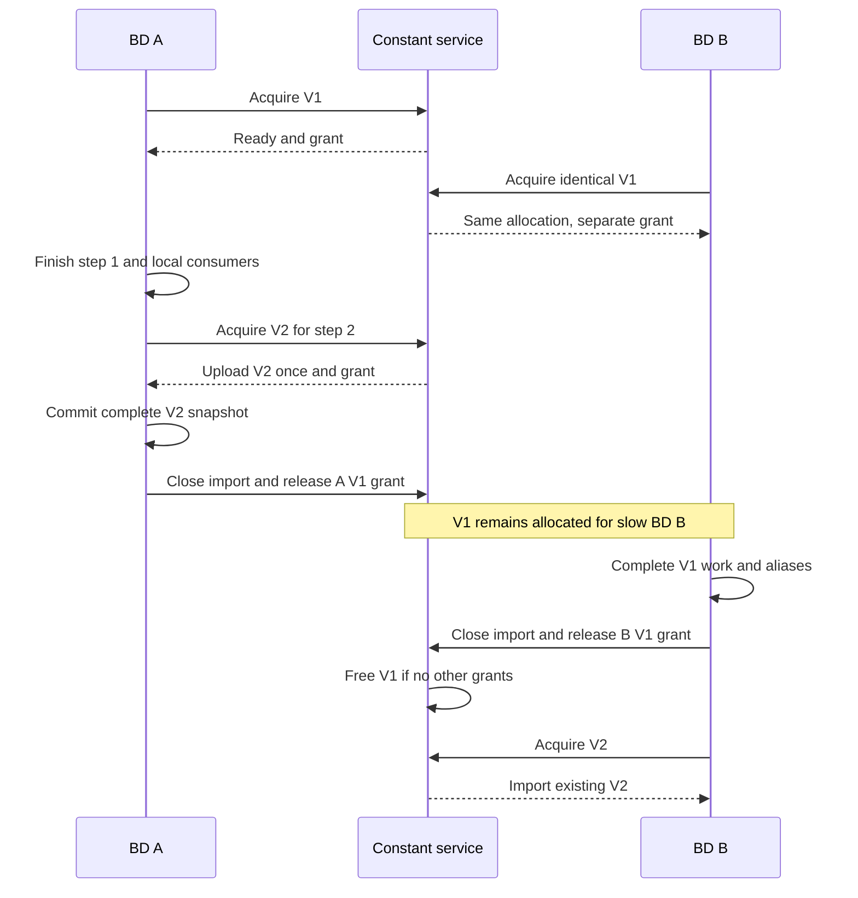

# Draft GPU transitions and shared calibration state

Design for Mona and Seema, 2026-10-07. Covers [#153](https://github.com/slac-lcls/lcls2/issues/153) and [#168](https://github.com/slac-lcls/lcls2/issues/168) together. Implementation and assignment await design review. This documentation is separate from Amanda’s reconstruction stack and should merge after [#151](https://github.com/slac-lcls/lcls2/pull/151).

Keep the current SMD0 → EB → BD workflow and external `GpuTask` API. Introduce one ordered controller per BD, immutable requested-constant snapshots, and an optional CUDA-IPC storage backend shared by workers on the same node and actual GPU. BeginStep advances a BD’s state only after its preceding event range and dependent consumers finish. Other BDs may still use an older snapshot. IPC shares storage; explicit protocols establish ordering, ownership, coordination, and retirement.

The recommended first implementation drains locally at step boundaries and allows different versions across BDs. It does not require all GPU peers to reach a transition together. Independent progress for the shared allocation owner is essential; this proposal recommends a small per-GPU constant service, subject to Mona and Seema approving its process and deployment cost. Transition correctness can ship with local constants before that choice is implemented.

## Current workflow and API

The source baseline is `features/psana2-gpu` at `9b32dda19b46807f7a4db62fb2351ba87b359e47`. The issue bodies were checked on October 7. The review findings linked in [#153](https://github.com/slac-lcls/lcls2/issues/153) and [#168](https://github.com/slac-lcls/lcls2/issues/168) also reference reviewed stack commit `e2cdad6e18fd9263d7adfeed0ce58d5ad074e070`. These snapshots identify evidence, not an instruction to rebase or modify the stack.


SMD0 sends normal small-data chunks to EB ranks. SMD0 and EB each keep transition history per recipient and prepend missing history. New transitions keep their position among L1 events. EB produces a CPU/SMD packet, a GPUBAT1 packet with L1 event identities and big-data descriptors, and a local `step_batch`. EB uses `step_batch` to maintain history; it does **not** transmit it as an independently ordered transition channel. MPI transmits the history-prefixed SMD packet alongside GPUBAT1. Serial processing obtains corresponding batches from the local reader/EB path. See [node.py](../../../psexp/node.py) and [eventbuilder.pyx](../../../eventbuilder.pyx).

A CPU BD still submits I/O, parses inputs, invokes user work on the assigned stream, copies publications, and delivers events. GPU kernels do not perform MPI or open files. Framework ownership distinguishes input windows, execution slots, result copies, and retained host results. Read grouping and execution batching are independent.

The preserved [external API](../user_kernels.md) is:

```python
from psana.gpu import GpuTask

def analysis(batch, stream):
    raw = batch.input("jungfrau.raw")
    pedestals = batch.calibconst("jungfrau", "pedestals")
    # Submit work on stream, retaining scratch and publishing output.
    # batch.keepalive(scratch)
    # batch.publish("result", output)

task = GpuTask(function=analysis,
               inputs=["jungfrau.raw"],
               calibconst=[("jungfrau", "pedestals")])

# Existing result interface:
# evt.gpu.get("result").on_cpu
```

The declaration is host-only. A callback handles one nonempty selected execution subbatch. `batch.run`, `batch.batch_id`, `batch.step_generation`, timestamps, and original event indices describe that invocation. Borrowed inputs and constants are read-only and must not be cached for later execution. All callback work uses the supplied stream; public parsed-input consumers have their existing completion-registration API. Publication storage remains alive through terminal D2H. Retained `.on_cpu` results are independent of slot reuse.

`RequestedConstants` currently validates requested native numeric NumPy arrays, unwraps `(array, metadata)` values, snapshots host bytes, and uploads one admitted copy per BD. It preserves shape, dtype, and values, including scalar and empty arrays. BeginStep refresh compares bytes after host transition handling; it does not query the calibration database. Sharing must preserve that behavior and must not reintroduce built-in calibration, gain inversion, or fixed Jungfrau array formats. Current dense segment bindings are sorted Configure IDs; this design preserves the current `segment_ids` API and original constant axes, without introducing a new segment-order convention.

The relevant defects and gaps are:

- The fast GPU EB appends BeginStep and then stops. A real packet is `[L1 A, L1 B, BeginStep 2]`; later step-2 L1 events are in a subsequent packet. `_handle_steps()` runs before this packet’s L1 submission, so A/B can get step 2’s state. Draining previously submitted work does not fix unsubmitted A/B.
- Serial GPU processing consumes transitions internally; MPI GPU `steps()` returns immediately. Both need a common stream that can support event and step views.
- `_iter_step_events()` uses service zero for empty records, colliding with ClearReadout. Filtering and `first_service()` compound the loss; file-read coalescing also drops its fence.
- SlowUpdate already reaches the host environment store. The missing evidence is correct event-associated values across updates, not absence of a dispatcher.
- The removed calibration IPC path was specialized to prepared Jungfrau arrays. Restoring its old leader formula or float32 assumptions would conflict with the current generic requested-constant API.

## Review findings as acceptance criteria

The source inspections and isolated probes recorded in the issues establish the design requirements. They are not end-to-end validation of this proposal.

| Finding | Required behavior | Acceptance evidence |
| --- | --- | --- |
| [GPU-148-01](https://github.com/slac-lcls/lcls2/pull/148#discussion_r4200896653), #153 P1 | Submit preceding L1 ranges with old state; dispatch leading history before its events; drain required consumers before changing local step state | Real EB split → manager → callback tests with changed and unchanged constants, trailing/leading BeginStep, repeated history, multiple transitions, and byte-split executions |
| [GPU-140-03](https://github.com/slac-lcls/lcls2/pull/140#discussion_r4159309391), #153 | Working serial/MPI `run.steps()` and `step.events()` with scan metadata and results | Two or more steps, empty steps, GPU-only and mixed events, ordinary MPI distribution and history catch-up; CPU-compatible boundaries |
| [GPU-141-02](https://github.com/slac-lcls/lcls2/pull/141#discussion_r4160862286), #153 | ClearReadout survives decoding, validation, dispatch, and bulk-read fencing | All-empty and missing-stream packets; malformed sizes still fail; actual service zero reaches `Run._handle_transition`; Enable file switching stays correct |
| SlowUpdate requirement in #153 | Event-associated EPICS values remain correct on either side of an update | CPU/GPU expected-value comparison, including an update inside a packet; no unconditional device/peer barrier |
| [GPU-149-04](https://github.com/slac-lcls/lcls2/pull/149#discussion_r4201235524), #153 | One stream owner; step completion differs from run close; deterministic early-exit API | Retained child/outer iterators, explicit close, normal next step, exceptions, terminate, repeated cleanup, bounded MPI shutdown |
| [GPU-147-01](https://github.com/slac-lcls/lcls2/pull/147#discussion_r4199547812), #168 P2 | Share identical requested constant storage behind the existing API | Two/four BDs per GPU allocate approximately one copy per live identical object; followers never first upload duplicates; equal results |
| #168 topology and lifetime requirements | Correct device peers, immutable versions, all imports closed before export free | Multiple nodes/GPUs/EB groups, differing selectors/values, delayed peers/consumers, version overlap, failed upload/import, early exit, repeated close |

The overall P1 on #153 comes from ordering, not a new P1 classification for every row. #156 was superseded by #153, not fixed. Coordinate packet-decoding work with [#154](https://github.com/slac-lcls/lcls2/issues/154), peer discovery with [#155](https://github.com/slac-lcls/lcls2/issues/155), and partial-setup rollback with [#169](https://github.com/slac-lcls/lcls2/issues/169).

## Proposed responsibilities

| Component | Responsibility | Owns |
| --- | --- | --- |
| SMD0 and EB transport | Existing event order, recipient history, coherent CPU/GPU packets | Send buffers and history until transport completion |
| Ordered packet planner in BD | Turn coherent packets into `L1Range` and `TransitionRecord` items without mutating live run state | Packet backing, decoded transition dgrams, stable event identities |
| Run stream controller in BD | Apply transitions once, bind a state snapshot to each execution, adapt one stream to events/steps | Local state cursor, iterator lifecycle, execution/input/result leases |
| `RequestedConstants` facade | Resolve exact requested arrays and atomically select a snapshot | Active snapshot reference and backend leases |
| Local backend | Serial/single-worker storage and reference semantics | Local allocations and charges |
| Shared constant service | Match immutable content, admit physical storage, upload/export, track reservations/imports, retire | Shared allocations, upload sources, catalog, physical budget |
| Import owner in BD | Create local array views, retain mapping across aliases and submitted work | One mapping reference, alias ownership, completion tokens |

Names for new components and protocol records are proposed interfaces, not existing classes. The service owns constants only; event reading, science kernels, and result delivery remain in BDs.

## Ordering and transition semantics

### Build an ordered plan from existing packets

Use the accompanying SMD packet as the ordering authority. Decode its framing once, retaining packet positions even when an L1 has no CPU dgrams. For each real non-L1 record emit a transition. For each L1 or validated all-empty GPU-only placeholder, consume the next GPUBAT1 L1 row. Preserve `(packet identity, original batch_event_index, timestamp)` through every slice. Validate counts, timestamp agreement where CPU dgrams exist, and descriptor ranges. Do not reconstruct order by sorting all transitions ahead of events.

Every L1 has a GPUBAT1 event-table row in the current split path, including zero-GPU-contribution rows. Such an event must remain deliverable even when no task callback is selected for it. An all-empty record is never a transition; its L1 meaning comes from the coherent event table. If this correspondence cannot be established, reject the packet instead of guessing. CPU-only batches without GPUBAT1 use their real dgrams.

The transition-only decoder can satisfy #153 by counting dgrams during construction, capturing the first present service, checking sizes before skipping `n_dgrams == 0`, and yielding service zero. The richer planner must additionally preserve empty-record positions for L1 correlation. It must not use that decoder’s omitted empty records as its L1 index. This separates decoder correctness from #154’s eventual decoding optimization.

Consecutive L1 rows form an `L1Range` bounded by every intervening transition. Byte-budget splitting then operates **within** that range. A submission captures immutable run/configuration/step identity, a requested-constant snapshot, and resolved file identities. It never consults a mutable “latest constants” pointer after submission. Batch indices remain the original EB indices rather than restarting in each range.

Compute read-file mappings with the same ordered controls. Keep the existing rule that all non-L1 records fence read coalescing, including ClearReadout; only Enable/chunkinfo changes files. Resolve immutable file identities for pending reads and retain file references through read completion. Metadata planning may run ahead; live transition application and callback admission may not. Initial implementation limits read-ahead to the current range to simplify boundary cleanup. Later read-ahead across a boundary needs an explicit proof for file/configuration and input lifetimes.

### Apply transitions once at the correct cursor

The controller produces ordered internal L1 deliveries and applied-transition markers. It alone calls `Run._handle_transition()` and performs GPU state actions. GPU `run.events()` hides markers; GPU `run.steps()` uses BeginStep/EndStep markers. Neither adapter updates the environment a second time. CPU-only adapters retain their current behavior.

Use a run-instance identity plus transition service/timestamp and validated payload identity to recognize an already-applied replay. Exact replay is idempotent locally; conflicting payloads for one identity fail. New catch-up history is applied in received order, including unseen empty steps. Do not use a process-local step counter as a cross-rank content version. Existing `batch.step_generation` remains a local progression value, incremented once per newly applied BeginStep; an internal logical step key identifies the source BeginStep independently of which BD first saw it. Unexpected backward state changes outside validated replay fail rather than rewind live state. Confirm this identity contract against fake-step and timestamp-jump fixtures before freezing it.

Before applying a transition, preceding events must have been submitted under their old snapshot and offered to the appropriate public iterator in order. At a required drain, retire producer work, terminal result copies, and registered external input consumers; finish deferred input-window uses and pending reads whose storage/state will change. An empty execution pool alone is insufficient. Delivery waits already required by the current producer path are distinct from an added transition fence.

| Transition or boundary | Host and logical effect | GPU and storage policy |
| --- | --- | --- |
| Configure / BeginRun setup | Establish configuration, run identity, host calibration source, envstore | Build parser/bindings and initial requested snapshot before first callback; startup readiness required |
| BeginStep | Apply host transition, advance step identity, inspect requested host values | Submit/deliver preceding range; drain local dependent consumers; resolve/pin changed or unchanged snapshot; then admit later range. No peer barrier and no implicit DB fetch |
| EndStep | Apply host transition and finish the child step | Initial policy drains the completed step’s local consumers before exposing step completion; pipeline remains open |
| SlowUpdate | Apply existing EPICS/envstore update in order | Split logical ranges; no constant refresh or unconditional GPU drain. Event-associated lookup must retain correct before/after values |
| Enable | Apply host transition and chunkinfo file change | Coalescing fence; old reads keep old file references. No unrelated constant or device fence |
| Disable | Preserve existing host transition | Coalescing fence; no invented constant refresh |
| ClearReadout, service 0 | Dispatch real dgrams through normal host handler | Coalescing fence; no invented file switch, event deletion, or constant change |
| EndRun | Apply after all prior admitted events are delivered/drained | Stop admission and finish once; release local resources and shared references; owner may retain exports used by peers |
| End of input, event limit, explicit terminal close | Finish or discard pending delivery according to API | Same idempotent finish path, without inventing an EndRun dgram; admit no events beyond limit |
| Reset / Unconfigure / unexpected Configure in active run | Preserve and validate record; configuration cannot change behind active parser pointers | Conservatively drain locally. Normal DataSource lifecycle must establish a new configured run before further L1; reject unsupported mid-run reconfiguration clearly |

The last row is a proposed explicit limitation, not a claim that arbitrary dynamic reconfiguration currently works. The initial scope is the existing experiment/run serial and MPI GPU path. Expanding GPU support to shmem/DRP or new input modes is separate.

Service validation must use the Python psana transition definitions: ClearReadout is 0, `L1Accept_EndOfBatch` is 11, L1Accept is 12, and `NumberOf == 13` is a sentinel, not a valid record. Use `TransitionId.isEvent()` rather than treating every non-12 value as a transition. Missing dgrams and out-of-range IDs still fail. Cover the shared `utils.first_service()` change with CPU tests.

## Constant versions and ownership

Keep three identities separate:

| Identity | Definition and authority |
| --- | --- |
| Logical state | Run instance, configuration identity, source BeginStep identity, and local generation; assigned by ordered transition processing |
| Snapshot manifest | Immutable mapping from each declared `(detector, key)` to exact content identity; built from that BD’s post-transition host source |
| Physical object | Immutable device storage for one selector/content/layout in a device peer group; catalog assigns allocation generation and owner |

One snapshot can reuse every object from the preceding step. Two peers at different steps can use the same bytes; peers at the same step with different host values must get different objects or an explicit application-policy error. They must never receive another peer’s values merely because their generation numbers match.

Canonical host snapshots preserve shape, native dtype, and C-order bytes, including bytewise distinctions such as NaN payloads and signed zero. Validate all selectors/values before starting allocation. Use a content digest for lookup, with exact metadata/byte comparison before deduplication, or an equivalent trusted immutable host-source identity. A hash alone is not a substitute for the agreed equality contract. Host snapshot copying must happen at a defined transition boundary; concurrent user mutation during resolution is unsupported.

Share per selector/content object, so overlapping declarations can reuse their intersection without uploading unrequested constants. Preserve physical constant axes and let user kernels map detector segments as today. Scalar arrays remain shape `()`; zero-byte arrays have metadata but need no exported device allocation. Empty declarations create no constant CUDA state or service dependency.

Refresh is a transaction: prepare the complete new manifest, acquire all its objects, then atomically replace the facade’s active snapshot. Failed acquisition leaves the old snapshot owned, rolls back newly acquired references, and stops further event admission. Since the host transition may already have occurred, the run fails rather than silently continuing with old values. Unchanged objects need no upload. Never overwrite a shared allocation in place.

Each execution owns its captured snapshot through its terminal consumers. Conservatively retain constants through publication D2H too: an output may alias input constant storage. The import wrapper’s allocation owner must also survive ordinary CuPy views and aliases. Callback return, generator advancement, dropping the facade, and `keepalive` are not completion signals.

For object `o`, freeing requires all of the following:

```text
no pending acquire/import grants for o
no active manifest or execution references to o
no local array aliases retaining o's mapping or exporter storage
all submitted users of o have completed successfully
every granted importer has acknowledged its mapping closed
```

Only the exporting owner frees physical storage and releases its physical charge. BDs close imports and release logical references; they never free the exporter allocation. Logical content identity can be reused after eviction, but a recreated allocation gets a fresh generation. Delayed releases cannot apply to a replacement object with the same content.

The public borrowed-array contract still forbids caching constants for later work. Defensive alias retention nevertheless prevents freeing live Python array storage after refresh/close. It cannot make arbitrary saved raw pointers or unregistered streams safe. A retained alias may keep storage charged and delay service teardown; report that retention explicitly. Normal supported use requires deterministic cleanup without garbage collection. Exceptional aliases must never be reclaimed merely because a timeout elapsed.

## CUDA IPC storage backend

CUDA IPC is useful for large, identical, read-only requested arrays shared by processes using one physical GPU. It can later carry other explicitly versioned immutable state, such as a prepared lookup table, if its ownership contract is equally clear. This proposal limits the first backend to requested constants. It does not share Python dictionaries, envstore mutation, scan callbacks, parser slot state, task outputs, MPI order, or mutable user scratch. Host shared calibration and geometry caches remain separate mechanisms.

Use dedicated IPC-compatible allocations for shared objects, with metadata containing base allocation size, array byte offset, shape, dtype, and byte length. Initial allocations use offset zero and contiguous arrays; validate `offset + length <= allocation size` and alignment before constructing a view. Do not export arbitrary CuPy pool suballocations or assume the current `owned_empty()` allocator is an IPC allocator.

NVIDIA requires export from the allocation base, gives no cross-process pointer-address guarantee, and requires importers to close mappings before the exporter frees memory. Wrap the imported local address with a CuPy memory owner that retains its mapping lease. These requirements come from the [CUDA IPC memory API](https://docs.nvidia.com/cuda/cuda-driver-api/cuda_driver_api/group__CUDA__MEM.html); the allocation-wrapper design above is proposed.

Initially finish the owner’s upload stream before publishing `READY` plus memory handles. A follower imports only after READY and skips local device allocation/upload entirely. This avoids a second distributed event lifecycle. A later optimization may publish an IPC readiness event and have each consuming stream wait on it. Such events require interprocess and disable-timing flags, and their lifetime must be retained too. See [CUDA event management](https://docs.nvidia.com/cuda/cuda-runtime-api/cuda_runtime_api/group__CUDART__EVENT.html). A memory handle alone proves neither readiness nor completion.

Capability checks use the actual deployment’s driver/runtime/CuPy combination. Serial or one-BD groups use the local backend. Proposed `auto` policy chooses shared storage only for a verified supported group; an unsupported topology uses a fully budgeted local fallback with a diagnostic. An explicit shared-required mode fails at startup. Runtime corruption, upload failure, or lost owner is a coordinated failure, not silent fallback to uncharged duplicates. Supported MIG sharing needs a device test; otherwise use the explicit unsupported policy.

## Peer coordination and progress

### Discover peers before event processing

Use #155’s topology work as a dependency. All parent-communicator members participate in initialization splits; subsequent discovery includes only GPU BDs. Respect launcher visibility, identify the selected device by full UUID and MIG instance where applicable, and group by node/shared-memory domain plus actual device identity across EB groups. A process-local device ordinal or `bd_rank - 1` arithmetic is not a peer identity. CPU-only/SMD0/EB roles need not create CUDA contexts.

Cache group membership, capacities, protocol version, and run-instance namespace before data delivery. Validate explicit per-BD budgets against aggregate device capacity. Log rank, role, node, actual device, group, backend, and budget. No new collective belongs in lazy manager creation or a BeginStep callback.

### Give the storage owner independent progress

Recommended shared-backend topology: one job-scoped helper per active shared GPU, elected/launched during coordinated startup and reachable through node-local control sockets. It owns only requested constant allocations and their catalog. BDs keep MPI transport and event work. The helper has an explicit CUDA context and no MPI membership; launch via a fresh executable/process environment, never fork an initialized CUDA process. Account for its host process and device-context overhead. Its lifetime belongs to the job/service supervisor, not the lifetime of the BD that launched it.

This choice ensures a BD blocked in arbitrary user analysis or waiting on its EB cannot stall another BD’s constant acquire/release. Requests do not require the helper to enter the data-processing loop. Deployment must provide a supported launch/supervision method within the Slurm allocation; agree that method before assigning the shared backend. If helpers are unacceptable, an elected BD owner is an alternative only after proving independent progress, including GIL, MPI-thread support if used, blocking receive, user-code stalls, and early BD exit. Merely adding polling at BeginStep does not meet the requirement.

Use bounded, versioned node-local control messages. No new Python object transport is needed on the GPUBAT1 hot path. Transfer canonical host bytes to the service through bounded staging/shared host storage during snapshot acquisition; do not assume a raw pointer in one BD is valid in the helper. Keep that storage alive through comparison/upload and include its host-memory cost in diagnostics.

| Message or state | Required meaning |
| --- | --- |
| `ACQUIRE(request, manifest/object identity)` | Reserve a reference before returning any usable handle; includes run, group, requester, and request generation |
| `PREPARING` | Object has one creator/upload; matching concurrent requests wait on it rather than create duplicate device copies |
| `READY(grant, allocation generation, metadata, handle)` | Upload complete and import reservation registered; publication is atomic |
| `IMPORTED(grant)` / `IMPORT_FAILED(grant)` | Establish mapping ownership or roll back the pending grant; partial multi-object acquisition is tracked |
| `RELEASE(grant)` | Requester has dropped manifest/execution/alias references, completed CUDA users, and actually closed the import; this is the close acknowledgement |
| `STOP_ADMISSION` / `LEAVE` | Stop new references from a client; leave only after outstanding grants are resolved or explicitly quarantined |
| `ERROR(request, phase)` | Preserve original cause, stop dependent work, and enter rollback or coordinated abort |

Messages are idempotent using request/grant/allocation generations. Closing and acquiring race through the owner catalog: a new grant either pins existing storage before retirement or waits for a new allocation; it never receives a handle being freed. Do not free based on a disconnected socket, a step watermark, a timeout, or a count of currently executing kernels. Pending imports count too.

No all-peer BeginStep handshake is needed. Each BD presents the exact snapshot it needs. Old objects can retire after their last grant closes even if a slow peer might later request the same content: that peer supplies its own immutable host snapshot and the service can recreate it. Avoid retaining every historical GPU version until all BDs reach EndRun. A bounded optional host cache may accelerate recreation but must not become an unbounded scan-history cache.

### Budget physical storage once

Let `D` be managed device capacity after explicit allowance for contexts, libraries, and external allocations. Reserve a shared-constant allowance `C` and per-BD working quotas `W_i` such that:

```text
C + sum(W_i) <= D
shared_live_bytes + shared_pending_bytes <= C
local_working_live_i + local_working_pending_i <= W_i
```

Charge shared allocation capacity once to the group ledger, including replacement overlap and quarantined objects. Imported bytes are observability (`borrowed`), not physical bytes added again to each BD’s committed total. Exporter ownership does not consume an arbitrary extra chunk of that BD’s work quota. Local fallback copies remain physical allocations and are fully charged. Pinned/host snapshots, retained host results, and user scratch need separate reporting; this policy cannot enforce a limit on arbitrary user allocations.

Use a fixed shared allowance first, with a minimum viable working allocation for every BD. Reserve changed objects for a snapshot transaction before creating them. Reduce execution overlap and trim only unreferenced caches under pressure. If active old versions plus one required new snapshot cannot fit, return a clear budget error after safe rollback; do not wait indefinitely for a slow peer, require a global transition barrier, or free old versions. An optional bounded retry may retire already-completed references, but pressure cannot create a wait cycle.

Example only: four BDs requesting the same 1 GiB need roughly 1 GiB of shared constant payload instead of 4 GiB. If an entire new version overlaps the old one, the shared payload reaches 2 GiB until retirement. Different values require distinct storage; partial changes can reuse unchanged objects. Allocation overhead and helper contexts are additional. These are capacity calculations, not measured throughput claims.

## Iterator ownership and cleanup

One run stream controller owns the manager, transport adapter, pending deliveries, and close state. `run.events()` and `run.steps()` are alternate views, not independent readers. Reject simultaneous iteration modes and multiple live child event readers. Give the outer and child iterators explicit idempotent `close()` support and compatibility with `contextlib.closing`.

| User action | Proposed semantics |
| --- | --- |
| Exhaust a step normally | Deliver its local events, apply EndStep, retire required consumers, invalidate the child; keep run open |
| Close a child early, or advance outer iterator with an unfinished child | Invalidate that child, consume the remainder to its boundary, process transitions and retire results, discard public delivery; then allow next step |
| Remainder includes unsubmitted L1 work | Initially run normal task submission and discard its delivery, preserving callback side effects and one scheduling rule. Skipping computation is a later opt-in contract |
| Bare `break` with retained iterator | No implicit close. Advancing the outer iterator invokes remainder handling; otherwise use explicit close/terminate |
| Close outer event/step iterator | Terminal local stream close; stop new local work, drain owned work, and drain the existing MPI transport protocol as necessary |
| Stop the MPI run globally | Call existing `run.terminate()` and close the owning iterator; do not assume local close is a collective stop request |
| Raise in user loop body | `with closing(...)` unwinds the owner; use `run.terminate()` when a global stop is intended. Bare loop-body exceptions cannot magically close a retained generator |
| Fatal callback/pipeline error | Preserve existing MPI global error protection; attempt bounded safe rollback, then abort rather than leave peers waiting |
| Use a retained iterator after child/owner close | Clear closed/stale-iterator error; no access to released storage |

The outer iterator keeps one lookahead marker so an unexpected next BeginStep or EndRun cannot be swallowed by child remainder processing. Empty BeginStep/EndStep pairs produce an empty Step. Do not synthesize a science step for L1 records outside explicit step boundaries; preserve CPU event/step behavior. MPI steps describe locally assigned events plus the transition history each rank receives, not a promise that every rank handles every L1. End-of-stream history delivery must preserve empty steps under normal routing.

Proposed usage after implementation:

```python
from contextlib import closing

with closing(run.steps()) as steps:
    for step in steps:
        with closing(step.events()) as events:
            for evt in events:
                analyze(evt)
                if stop_this_step(evt):
                    break  # child close consumes/discards the remainder
        if stop_run():
            run.terminate()  # request coordinated MPI stop
            break           # outer close performs local cleanup
```

Normal terminal cleanup follows this order: stop admission; unwind active delivery scopes; finish submitted reads and retain file/input owners; complete producer, D2H, and registered input consumers; preserve retained host result rows; release parser/input/slot resources; drop snapshot references; close eligible IPC mappings and acknowledge releases; release pinned staging; finish outstanding EB communication. The service frees exports only after the ownership predicate is true and stops after all clients have left. Repeating any phase is safe.

Partial initialization uses staged rollback records from the first reservation onward. Upload failure retains source/destination until completion is known. Import failure closes every successful partial import and acknowledges each grant; it must not call a full manager close on a half-built object. If CUDA completion or a peer’s import closure cannot be proven, quarantine storage and its charge, report phase/rank/object, and use bounded job failure. No graceful owner failover is proposed: a lost exporter invalidates the shared group and triggers MPI/job abort. Timeout means failed coordination, never permission to free potentially live memory.

Escaped aliases are an exceptional retention case: local run close can become logically terminal while the mapping/service remains pinned. Diagnostics must distinguish logically closed from fully reclaimed. At final job shutdown, unresolved aliases or failed completion require a reported failure/quarantine path, rather than falsely claiming a clean zero-allocation exit. The external API continues to prohibit using such aliases for new work.

## Execution timelines

### Trailing BeginStep with changed constants

```text
EB packet 1: [L1 A, L1 B, BeginStep 2]    EB packet 2: [L1 C, ...]
BD state:    step 1, snapshot V1

plan           L1Range(A,B)              BeginStep 2             L1Range(C,...)
read/execute   admit A/B under V1 -----> producer done
delivery       yield A/B under step 1 -> finish result/input consumers
host state                              apply BeginStep 2
constants                               resolve host bytes -> acquire V2
callback                                                        C uses V2
IPC lifetime   V1 pinned ----------------commit V2, then release V1 locally
```

With unchanged requested bytes, step identity advances but the manifest reuses V1 and causes no new upload. A leading catch-up BeginStep follows the same state action before its first L1. Exact replay does not increment the local generation again.

### Uneven peers on one GPU



If V2 cannot fit alongside V1, A gets a bounded admission error, preserves the old snapshot, and rolls back its pending reservation; it cannot overwrite V1. B can finish without reaching A’s step. The helper continues servicing releases while A is in user code or has left event processing.

### SlowUpdate and file boundaries

```text
packet:     [L1 A, SlowUpdate U, L1 B, ClearReadout, Enable(chunk 2), L1 C]
state:       EPICS old  | EPICS new ---------------------------------->
delivery:    A          | B                                 | C
read file:   chunk 1 -------- chunk 1 -------- fence -------- chunk 2
constants:   V1 ----------------------------------------------------->
```

All controls remain ordered; ClearReadout creates a coalescing boundary without changing the file. C’s read has immutable chunk-2 identity. SlowUpdate changes event-associated host metadata without a group barrier or constant refresh. Older asynchronous copies/input consumers may finish under their existing owners.

### Child close followed by run termination

```text
step 1: yield A -> child close -> invalidate child -> process/discard rest
        -> apply EndStep -> retire step consumers -> outer yields step 2
step 2: yield C -> run.terminate -> outer close -> no new submissions
        -> drain reads/executions/D2H/input users -> close imports -> release
service: retain any peer grants -> final releases -> free exports -> stop
```

On import failure after some handles opened, close those mappings before grant rollback. On a failed CUDA join, keep owners quarantined and invoke the coordinated failure path; no timeline step assumes Python object destruction proves device completion.

## Alternatives and tradeoffs

| Choice | Benefit | Cost or failure mode | Recommendation |
| --- | --- | --- | --- |
| Ordered BD plan over current SMD plus GPUBAT1 | Preserves transport and fixes leading/trailing order in one place | Must validate GPU-only placeholders and avoid duplicate dispatch | First implementation |
| Separate EB transition-only packets | Makes boundaries explicit on the wire | Requires pending-transition storage, history coherence, empty-packet and end-of-input changes across EB calls | Reconsider only if planning cannot preserve current ABI clearly |
| New GPUBAT ABI with explicit transition indices | Less BD reconstruction and potential decode savings | Version negotiation, EB/history integration, broader review | Defer; coordinate with #154 |
| Local drain at step boundaries plus immutable shared objects | Simple local correctness; peers progress independently | Step latency and overlapping device versions | Recommended baseline |
| Fully versioned overlapping steps within one BD | Can hide transition latency | Requires immutable host scan/configuration views, step delivery queues, and more memory | Later optimization after measured need |
| One mutable shared array plus all-peer barrier | One allocation and simple overwrite point | Rank skew, skipped steps, user stalls and early exit can deadlock; couples EB groups | Reject for event-loop use |
| Independent constant service | Progress survives arbitrary BD/user stalls and BD departure | Extra helper lifecycle, CUDA context, launch and monitoring work | Preferred shared backend, pending deployment review |
| Elected BD exporter with independent progress worker | Reuses an existing process/context | Must prove thread/GIL/transport progress and retain exporter after local close | Accept only with adversarial progress tests |
| Per-BD local snapshots | Minimal coordination and useful correctness baseline | Duplicates VRAM; does not complete #168 for supported peer groups | Stage 1 and explicit fallback |
| Restore old Jungfrau IPC helper unchanged | Existing prototype history | Wrong generic types/selectors, ownership and topology assumptions | Reject |
| Share across GPUs or nodes | Potentially fewer copies in other architectures | Remote-access cost, topology constraints, different sharing transport | Out of initial scope; one shared copy per GPU group |

## Staged implementation tasks

These are proposed task boundaries and dependencies, with no assignees. Stages describe exit criteria rather than calendar estimates.

| Stage | Work and likely touch points | Exit criterion |
| --- | --- | --- |
| 0 Review contracts | Mona/Seema decisions below; agree CPU step oracle, state identities, remainder semantics, helper deployment and budget policy | Approved interfaces and acceptance matrix before implementation assignment |
| 1 Ordered local controller | Planner and ClearReadout path in `gpu_events.py`, `gpu_file_epochs.py`, `utils.py`; immutable local snapshot capture in `gpu_task.py`/`gpu_task_batch.py`; preserve EB wire ABI | Real EB trailing BeginStep regression passes; ClearReadout reaches host/fence; changed/unchanged state correct through byte splits; no shared backend yet |
| 2 Event and step adapters | `run.py`, `mpi_ds.py`, `step.py`, manager/transport lifecycle; one GPU stream owner and applied markers | Serial/MPI steps work, empty/history steps preserved, no duplicate envstore updates; early exit/exception/terminate matrix passes |
| 3 Actual peer discovery and budget partition | Coordinate #155 in MPI initialization and budget setup; backend interface behind `RequestedConstants` | Correct membership across EB groups/nodes/masks; CPU roles avoid CUDA; explicit budgets checked; local backend obeys same snapshot contract |
| 4 IPC storage prototype | Shared allocator/import owner, service/progress mechanism, bounded host staging, acquisition transaction, physical-once ledger | Two/four BDs share synthetic arbitrary numeric arrays with no follower upload; differing values isolated; accounting and aliases verified |
| 5 Joint refresh and shutdown | Integrate stages 1–4; changed/unchanged BeginStep, grant generations, rollback, quarantine and service teardown; coordinate #169 | Delayed peer/consumer, failed upload/import, owner/client exit and pressure tests complete within harness timeout; no premature free |
| 6 Acceptance and rollout | User docs/examples, debug metrics, synthetic then available real-data CPU/GPU comparisons, supported-topology opt-in and fallback policy | All criteria below pass; Mona/Seema review evidence before default enablement |

Stages 1–2 do not depend on a shared service. Stages 3–4 depend on agreement about topology, budgets, and owner progress. Stage 5 joins them; do not claim #168 complete from a standalone handle-sharing demo. Follow-up PRs should be independently reviewable after this design is accepted, without rewriting Amanda’s stack during design work.

### Verification matrix

| Area | Required cases and assertions |
| --- | --- |
| Ordered planning | Real fast EB append/break; leading and trailing history; exact repeated records; multiple controls; all-empty CPU slots; zero-GPU rows; transition-only packets; packet backing retained; malformed framing rejected |
| State and values | Expected constants/config/scan values before and after BeginStep; unchanged snapshots; in-place host changes; old/new consumers spanning slots; byte-split ranges; event indices and timestamps preserved |
| Host metadata | Explicit expected EPICS values before/after SlowUpdate in one packet, plus CPU comparison; retained events queried after later updates; no unconditional GPU/peer fence |
| ClearReadout | 0 present, empty absent, leading/trailing missing streams, multiple dgrams; malformed empty-looking sizes rejected; complete host path; bulk off/on; Enable chunkinfo unchanged; sentinel 13 rejected |
| Public delivery | Serial and MPI, event/step APIs, two/empty steps, GPU-only/hybrid/mixed CPU events, no task, empty task declarations, sparse publication names/results; retained CPU results survive cleanup |
| Iterator lifecycle | Normal step progression; bare break with retained child; explicit child/outer close; next outer step; user exceptions; terminate; repeated close; stale iterator use; EndRun/EOF/max-events; outstanding EB receive |
| Shared storage | 2 and 4 BDs per GPU; one/multiple nodes, GPUs and EB groups; uneven rank counts; serial/single BD; supported visibility masks/MIG or explicit rejection; same/different selectors and contents |
| Array fidelity | Numeric dtype matrix, complex values, scalar/zero-length arrays, noncontiguous host input normalized, shape changes, exact byte comparisons, original segment axis; no implicit calibration preparation |
| Ownership and failures | Delayed producer/D2H/input consumer; aliases surviving refresh; partial upload/import; acquire racing final release; duplicate/delayed messages; lost helper/client; insufficient overlap budget; no use-after-free or double charge |
| Progress | One BD stalled in user code, another acquiring/releasing; one BD finishes earlier; empty-step peers and cross-EB peers; no transition collective; failures terminate within a declared harness timeout |

Instrument allocation/upload/import/open/close/free counts by group, selector, content and allocation generation. Assert that every free follows all close acknowledgements and CUDA completions, and that followers never transiently allocate their own constant payload. Report group physical live/pending/retained/quarantined bytes separately from per-rank imported bytes and working bytes. Device free-memory measurements include context/allocator overhead; do not use them alone to infer one-copy sharing.

Implementation validation must run focused CPU, device, serial and MPI tests, then the required psana core groups in the built environment:

```bash
pytest psana/psana/tests/
pytest psana/psana/tests/byhand_*
```

Use synthetic arrays/dgrams first so correctness work does not depend on unavailable SDFDATA. Device tests require real IPC-capable hardware and deployment versions. Performance comparisons come after correctness: record GPU/BD placement, batch size, slot depth, backend, shared/working budgets, version-change frequency, GDS versus fallback, memory high water, transition wait time, and throughput. No throughput gain is an acceptance assumption.

## Decisions for Mona and Seema

| Decision | Proposed starting point | Why it must be settled before assignment |
| --- | --- | --- |
| Boundary policy | Local BeginStep/EndStep drain; ordered SlowUpdate with no blanket fence; immutable versions across peers | Defines controller versus backend responsibilities and acceptable latency |
| Constant refresh authority | Only declared arrays from post-host-transition source; byte equality; no DB fetch | Establishes who may change scan-dependent state and which fixture is the expected-value oracle |
| Identity and replay | Internal run/config/BeginStep identity; local public generation; no deduplication by generation alone | Needs agreement on timestamp jumps, fake steps, history replay, and future public cross-rank IDs |
| Iterator semantics | One owner; child close/outer advance consumes and discards remainder while preserving task execution; outer close terminal locally | User-visible behavior, callback side effects, and MPI termination documentation depend on it |
| IPC exporter and progress | Per-GPU constant helper supervised for the job; elected BD only with proven independent progress | Choose deployment model, process/context cost, launch ownership, and failure escalation |
| Sharing granularity and mismatch | Deduplicate exact selector/content objects; differing values remain distinct and observable | Prevents semantic substitution while supporting partial selector overlap |
| Capacity policy | Fixed group constant reserve plus validated BD work quotas; explicit error if overlapping live versions cannot fit | Determines configuration surface and pressure/failure behavior; depends on #155 |
| Fallback and support | Local serial/single-BD backend; capability-tested shared groups; explicit unsupported fallback/required mode | Need initial supported CUDA/CuPy/Slurm/MIG configurations and rollout default |
| Exceptional retention | Preserve alias owners and charges; report incomplete reclamation; no exporter failover | Defines cleanup guarantees and tests without promising safety for arbitrary raw pointers |
| Delivery plan | Approve separate follow-up stages after agreeing these contracts | Allows #153 correctness work to proceed independently while keeping #168’s end-to-end acceptance intact |

The design baseline is ready for this review. Proposed tasks remain unassigned; this documentation does not implement either issue or resolve the review findings.
