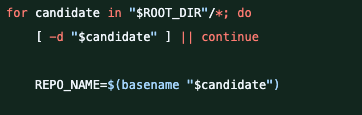
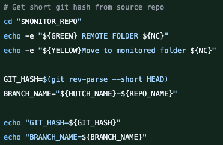
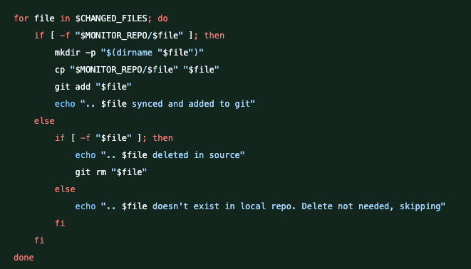

# Tag and Branch Scripts

## `single_push_collective_tag.sh`

### Purpose

Stored within the `lcls2` repository, this script creates tags for deployed production versions of the DAQ within a hutch. This allows accurate bookkeeping regarding what versions are deployed at a specific date per hutch.

### Usage

The script takes in arguments in order to be used across both `lcls2` and `ami`. There is only one copy of the script and it lives within the `lcls2` repo.

- **`hutch_name`** — The name of the hutch, e.g., `xpp`, `tmo`.
  - Used as part of the tag name.
- **`root_dir`** — The directory that stores the production `lcls2` repos (i.e., the DAQs at each hutch).
- **`tag_repo_path`** — The path to the repo used solely for pushing new tags. There is one for `lcls2` and one for `ami`:
  - `/sdf/group/lcls/ds/ana/sw/conda2/rel/lcls_tag_repo/lcls2`
  - `/sdf/group/lcls/ds/ana/sw/conda2/rel/ami_tag_repo/ami`
- **`prefix`** — Designates whether the script is being used for `ami` or `lcls2`:
  - Use `"ami"` for ami
  - Use `"lcls"` for lcls2

```
./single_push_collective_tag.sh <hutch_name> <root_dir> <tag_repo_path> <prefix>
```

### Script

This does not go over all parts of the script, but covers important details.

**Fetch latest commits:**

```bash
# Fetch all commits to ensure we have all the hashes
echo -e "${BLUE}Fetching latest commits...${NC}"
git fetch --all
echo -e "${GREEN}Fetch complete${NC}"
echo ""
```

The `git fetch --all` is applied to the tag repo. This ensures we are pushing to an up-to-date repo. `pull` is not used because it performs a merge to the local copy — `fetch` is lighter.

**The loop:**

```bash
for item in "$ROOT_DIR"/*; do
    # Skip if not a directory
    if [ ! -d "$item" ]; then
        continue
    fi
```

This loops through each item in the root directory argument.

**Checking for git repos with the correct prefix:**

```bash
    # Check if it's a git repository
    if [ -d "$item/.git" ]; then
        REPO_NAME=$(basename "$item")
        # Only process repos that start with the requested prefix
        if [[ "$REPO_NAME" != ${PREFIX}* ]]; then
            continue
        fi
```

Within the loop, it checks that the item is a git repo and that it uses the prefix. This is because the root directory contains a mix of `ami` and `lcls2` clones.

**Getting the clone commit hash:**

```bash
        # Get the clone commit hash
        cd "$item"
        GIT_HASH=$(git reflog --grep-reflog=clone -n 1 --format='%H' 2>/dev/null)
```

If the item is a repo with the correct prefix, it retrieves the hash of the commit when it was cloned.

**Building the tag name:**

```bash
        CLONE_TIME=$(git reflog --grep-reflog=clone -n 1 --format='%ct' 2>/dev/null)
        if [ -z "$CLONE_TIME" ]; then
            echo -e "${YELLOW}Warning: Could not determine clone time${NC}"
            continue
        fi
        DATE_STR=$(date -d @"$CLONE_TIME" +%Y%m%d)
        TAG_NAME="${HUTCH_NAME}-${DATE_STR}"
        echo -e "${GREEN}Tag Name: ${TAG_NAME}${NC}"
```

The tag name is built from the hutch name argument and the date when the repo was cloned.

**Checking hash and tag existence:**

```bash
        cd "$TAG_REPO_PATH"
        # Check if commit exists in tag repo
        if ! git rev-parse "$GIT_HASH" >/dev/null 2>&1; then
            echo -e "${YELLOW}Warning: Commit ${GIT_HASH} not found in tag repo. Skipping.${NC}"
        else
            # Check if tag already exists locally in tag repo
            if git rev-parse "$TAG_NAME" >/dev/null 2>&1; then
                echo -e "${YELLOW}Tag '${TAG_NAME}' already exists in tag repo. Skipping creation.${NC}"
            else
                echo -e "${GREEN}Creating tag ${TAG_NAME} in tag repo${NC}"
                git tag -a "$TAG_NAME" "$GIT_HASH" -m "Tag for ${HUTCH_NAME} install"
```

It verifies that the hash exists in the history of the tag repo, then checks whether the tag already exists. This repeats across each item in the path and ends with a single push.

---

## `branch_out.sh`

### Purpose

The core idea is that this script monitors the DAQ directories in each hutch. If a change is detected, it creates a branch and pushes to the `lcls2` repo.

### Usage

The script takes in arguments in order to be used across both `lcls2` and `ami`. There is only one copy of the script and it lives within the `lcls2` repo.

- **`hutch_name`** — The name of the hutch, e.g., `xpp`, `tmo`.
  - Used as part of the branch name.
- **`root_dir`** — The directory that stores the production `lcls2` repos (i.e., the DAQs at each hutch).
- **`branch_dir`** — The path to a single base git repository where changes will be applied. There is one for `lcls2` and one for `ami`:
  - `/sdf/group/lcls/ds/ana/sw/conda2/rel/branch_repo_lcls2/lcls2`
  - `/sdf/group/lcls/ds/ana/sw/conda2/rel/branch_repo_ami/ami`
- **`prefix`** — Designates whether the script is being used for `ami` or `lcls2`:
  - Use `"ami"` for ami
  - Use `"lcls"` for lcls2

```
./branch_out.sh <hutch_name> <root_dir> <branch_dir> <prefix>
```

### Script

This does not go over all parts of the script, but covers sections people may get stumped on.

**Main loop:**



This is the main loop. The purpose is to loop over all candidate items in the production directory and check whether the item is a production clone of a repo.

**Getting the git hash and branch name:**



When a candidate is confirmed as a cloned production repo, the current git hash is retrieved and the branch name is set. The branch name is the hutch name plus the repo name. The repo name is usually `repo_date`. The repo name is included in the branch name because there can be multiple copies of the same repo that each need a branch.

**Applying the changes:**



This will apply the changes.

---

## Cron

You need to be on `psrel@sdfcron001`. The cron jobs themselves must be run as `psrel`. The `psrel` user is needed so that the dev team can update as needed, rather than relying on a single developer. The jobs are set to run once a week.

> **Note:** `psrel` has git push access on `lcls2` and `ami` when using SSH clones.

These jobs currently exist only for `xpp`, but will be expanded to other hutches when they migrate to SDF.

```cron
# ---- LCLS2 TAG ----
0 2 * * 0 /sdf/group/lcls/ds/ana/sw/conda2/rel/tag_repo_lcls2/lcls2/scripts/tag_scripts/single_push_collective_tag.sh xpp /sdf/group/lcls/ds/ana/sw/conda2/rel/xpp /sdf/group/lcls/ds/ana/sw/conda2/rel/tag_repo_lcls2/lcls2 lcls > /sdf/group/lcls/ds/ana/sw/conda2/rel/cron_logs/lcls2_tag/tag_job.log 2>&1 || echo "Tag job FAILED on $(hostname) at $(date). Check log." | mail -s "Tag Job Failure" mavaylon@slac.stanford.edu

# ---- AMI TAG ----
0 2 * * 0 /sdf/group/lcls/ds/ana/sw/conda2/rel/tag_repo_lcls2/lcls2/scripts/tag_scripts/single_push_collective_tag.sh xpp /sdf/group/lcls/ds/ana/sw/conda2/rel/xpp /sdf/group/lcls/ds/ana/sw/conda2/rel/tag_repo_ami/ami ami > /sdf/group/lcls/ds/ana/sw/conda2/rel/cron_logs/ami_tag/tag_job.log 2>&1 || echo "AMI Tag job FAILED on $(hostname) at $(date). Check log." | mail -s "AMI Tag Job Failure" mavaylon@slac.stanford.edu

# ---- LCLS2 BRANCH ----
0 2 * * * /sdf/group/lcls/ds/ana/sw/conda2/rel/xpp/branch_lcls2/scripts/tag_scripts/branch_out.sh xpp /sdf/group/lcls/ds/ana/sw/conda2/rel/xpp /sdf/group/lcls/ds/ana/sw/conda2/rel/branch_repo_lcls2/lcls2 lcls > /sdf/group/lcls/ds/ana/sw/conda2/rel/cron_logs/lcls2_branch/branch_job.log 2>&1 || echo "LCLS2 Branch job FAILED on $(hostname) at $(date). Check log." | mail -s "LCLS2 Branch Job Failure" mavaylon@slac.stanford.edu

# ---- AMI BRANCH ----
0 2 * * * /sdf/group/lcls/ds/ana/sw/conda2/rel/xpp/branch_lcls2/scripts/tag_scripts/branch_out.sh xpp /sdf/group/lcls/ds/ana/sw/conda2/rel/xpp /sdf/group/lcls/ds/ana/sw/conda2/rel/branch_repo_ami/ami ami > /sdf/group/lcls/ds/ana/sw/conda2/rel/cron_logs/ami_branch/branch_job.log 2>&1 || echo "AMI Branch job FAILED on $(hostname) at $(date). Check log." | mail -s "AMI Branch Job Failure" mavaylon@slac.stanford.edu
```
